## Blocco 0 · Apertura: la provocazione {.divider background-image="assets/title-bg-bokeh.jpeg" background-size="cover" background-position="center" background-color="#002060"}

::: {.divider-sub}
da dove nasce l'idea di "AI tradizionale" e perché è fuorviante
:::

## Una provocazione per cominciare {footer="Orso Peruzzi · Apprendimento statistico (CONAD Nord Ovest) · Apertura"}

si sente spesso parlare di **"AI tradizionale"** per indicare tutto ciò che non è deep learning.

l'etichetta suggerisce qualcosa di vecchio, superato, di serie B.

::: {.fragment}
**la tesi di oggi:** l'apprendimento statistico è machine learning a tutti gli effetti, ed è la base concettuale da cui discendono anche i modelli più avanzati, fino agli LLM.
:::

## "AI tradizionale": una storia lunga due secoli {footer="Orso Peruzzi · Apprendimento statistico (CONAD Nord Ovest) · Apertura"}

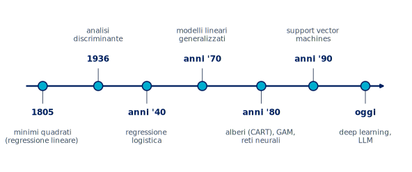{width="96%" fig-alt="Linea del tempo dello statistical learning, dai minimi quadrati del 1805 al deep learning di oggi"}

- Non è una moda recente: i minimi quadrati nascono per l'astronomia a inizio Ottocento;
- ogni epoca ha aggiunto un mattone, fino alle reti profonde di oggi;
- "tradizionale" non vuol dire superato, vuol dire fondante.

## Perché il termine è fuorviante {footer="Orso Peruzzi · Apprendimento statistico (CONAD Nord Ovest) · Apertura"}

- Il termine nasce per contrapporre i vecchi sistemi simbolici e a regole alle reti neurali;
- oggi viene usato a sproposito per liquidare regressioni, alberi e SVM come tecnologia minore;
- ISL lo dice chiaro: lo statistical learning non va visto come una serie di scatole nere;
- una regressione logistica e una random forest sono lo stesso paradigma di una rete: imparare dai dati.

## La mappa del campo {footer="Orso Peruzzi · Apprendimento statistico (CONAD Nord Ovest) · Apertura"}

:::: {.columns}

::: {.column width="48%"}
- L'intelligenza artificiale è l'insieme più ampio;
- il machine learning ne è il cuore moderno, e coincide con l'apprendimento statistico;
- il deep learning è un sottoinsieme del machine learning, non un campo separato;
- "AI tradizionale", semmai, sono i vecchi sistemi a regole.
:::

::: {.column width="52%"}
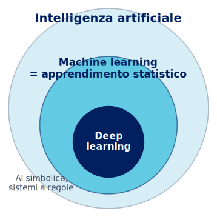{width="88%" fig-alt="Cerchi concentrici: l'intelligenza artificiale contiene il machine learning, che coincide con l'apprendimento statistico e contiene il deep learning"}
:::

::::

## Il programma della giornata {footer="Orso Peruzzi · Apprendimento statistico (CONAD Nord Ovest) · Apertura"}

:::: {.columns}

::: {.column width="50%"}
### Mattina · teoria (4 ore)

- Apertura: perché "AI tradizionale" è un'etichetta fuorviante;
- dai modelli statistici allo statistical learning, l'equazione $Y = f(X) + \varepsilon$;
- il cuore del corso: errore, overfitting e trade-off bias-varianza;
- le famiglie di modelli: lineare, regolarizzazione, alberi, ensemble, SVM;
- reti neurali e la big picture, fino agli LLM.
:::

::: {.column width="50%"}
### Pomeriggio · pratica (4 ore)

- NB0, setup su Colab e prima previsione;
- NB1, regressione e bias-varianza resi visibili;
- NB2, classificazione, regolarizzazione e cross-validation;
- NB3, alberi, ensemble e il caso retail Conad;
- NB4, demo di una piccola rete neurale.
:::

::::

## Blocco 1 · Dal modello statistico allo statistical learning {.divider background-image="assets/title-bg-bokeh.jpeg" background-size="cover" background-position="center" background-color="#002060"}

::: {.divider-sub}
ISL, capitoli 1 e 2 · frame di Torelli
:::

## Cosa chiedevamo alla statistica {footer="Orso Peruzzi · Apprendimento statistico (CONAD Nord Ovest) · Dal modello allo statistical learning"}

esempi classici, in ambito aziendale e assicurativo, che vengono prima del machine learning:

- valutare la probabilità che un cliente compri un prodotto viste le sue caratteristiche;
- classificare i clienti in fedeli e infedeli sulla base della loro storia;
- prevedere la spesa aggiuntiva per l'upgrade di un prodotto o servizio;
- prevedere il numero di sinistri di una classe di assicurati, o stanare le frodi.

::: {.fragment}
in tutti i casi: dai dati a una risposta quantitativa su qualcosa che non osserviamo ancora.
:::

## Lo schema comune: risposta e predittori {footer="Orso Peruzzi · Apprendimento statistico (CONAD Nord Ovest) · Dal modello allo statistical learning"}

- C'è una **risposta** $Y$, il fenomeno di interesse, ad esempio le vendite di un prodotto;
- ci sono dei **predittori** $X_1, X_2, \dots, X_p$, le informazioni note;
- esempio ISL, dataset Advertising: $Y$ sono le vendite, $X_1, X_2, X_3$ i budget su TV, radio, volantino;
- la risposta ha tanti nomi (output, target, variabile dipendente), i predittori altrettanti (input, feature, covariate).

## L'equazione di tutto: $Y = f(X) + \varepsilon$ {footer="Orso Peruzzi · Apprendimento statistico (CONAD Nord Ovest) · Dal modello allo statistical learning"}

:::: {.columns}

::: {.column width="50%"}
$$
Y = \underbrace{f(X)}_{\text{sistematica}} + \underbrace{\varepsilon}_{\text{stocastica}}
$$

- $f$ è la relazione sistematica, sconosciuta, che lega $X$ a $Y$;
- $\varepsilon$ è l'errore, indipendente da $X$ e a media nulla;
- $f$ è l'informazione che $X$ ci dà su $Y$;
- tutto il corso parla di come stimare questa $f$.
:::

::: {.column width="50%"}
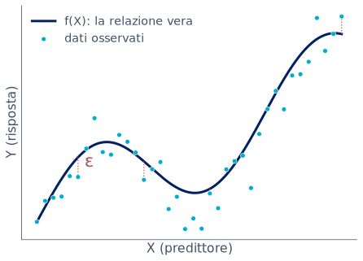{width="100%" fig-alt="Nuvola di punti attorno a una curva: la relazione vera f e l'errore epsilon"}
:::

::::

## Stimare $f$ per due scopi {footer="Orso Peruzzi · Apprendimento statistico (CONAD Nord Ovest) · Dal modello allo statistical learning"}

stimiamo $f$ con $\hat f$, e prevediamo con $\hat Y = \hat f(X)$. l'errore di previsione si scompone:

$$
\mathbb{E}\big[(Y-\hat Y)^2\big]
= \underbrace{\big[f(X)-\hat f(X)\big]^2}_{\text{riducibile}}
+ \underbrace{\operatorname{Var}(\varepsilon)}_{\text{irriducibile}}
$$

- la parte **riducibile** dipende da quanto è buona $\hat f$, e su quella possiamo lavorare;
- la parte **irriducibile** viene da $\varepsilon$, fattori non misurati o puro caso, e non si elimina;
- nessun modello, per quanto sofisticato, scende sotto l'errore irriducibile.

## Primo scopo: predizione {footer="Orso Peruzzi · Apprendimento statistico (CONAD Nord Ovest) · Dal modello allo statistical learning"}

- A volte abbiamo gli input $X$ e ci serve solo una buona previsione di $Y$;
- $\hat f$ può essere una scatola nera: non importa la sua forma, conta che $\hat f(X)$ sia vicino a $Y$;
- esempio ISL: una campagna di marketing diretto, vogliamo solo prevedere chi risponde;
- esempio Conad: quanto spenderà questo cliente nei prossimi dodici mesi?.

## Secondo scopo: interpretazione {footer="Orso Peruzzi · Apprendimento statistico (CONAD Nord Ovest) · Dal modello allo statistical learning"}

qui $\hat f$ non può essere una scatola nera, vogliamo capirne la forma:

- quali predittori sono davvero associati alla risposta?;
- in che direzione e con quale intensità agiscono?;
- la relazione è semplice e lineare o più complicata?;
- esempio ISL Advertising: di quanto crescono le vendite per ogni euro in più sul volantino?.

## Quiz lampo: predizione o interpretazione? {footer="Orso Peruzzi · Apprendimento statistico (CONAD Nord Ovest) · Dal modello allo statistical learning"}

vogliamo sapere **di quanto** un euro speso in volantino fa aumentare le vendite, per decidere il budget.

- A) è un problema di predizione;
- B) è un problema di interpretazione;
- C) nessuno dei due.

::: {.fragment}
::: {.callout-tip icon=false title="Risposta"}
**B**, interpretazione: ci interessa il legame tra un predittore e la risposta, non solo il numero finale.
:::
:::

## Modeling vs learning {footer="Orso Peruzzi · Apprendimento statistico (CONAD Nord Ovest) · Dal modello allo statistical learning"}

:::: {.columns}

::: {.column width="56%"}
- **Modeling**, la statistica classica: postulo un meccanismo generatore dei dati, una forma per $f$ nota a meno di pochi parametri, e la uso per spiegare;
- **learning**: tratto $f$ come una scatola nera e cerco un algoritmo che la approssimi bene, con priorità alla previsione;
- non è un confine netto, ma uno spostamento di enfasi, dalle assunzioni ai dati.
:::

::: {.column width="44%"}
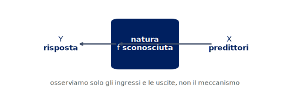{width="100%" fig-alt="La natura come scatola nera che lega gli input X alla risposta Y"}
:::

::::

## All models are wrong, but some are useful {footer="Orso Peruzzi · Apprendimento statistico (CONAD Nord Ovest) · Dal modello allo statistical learning"}

> "Essentially, all models are wrong, but some are useful." (G. Box)

- Ogni modello è una semplificazione della realtà, può essere sbagliato ma utile;
- il rasoio di Occam: tra modelli che spiegano i dati quasi ugualmente bene, scegli il più semplice;
- assunzioni comode (normalità, linearità, indipendenza) a volte non bastano a prevedere bene;
- da qui la spinta verso metodi più flessibili, lo statistical learning.

## Parametrico vs non parametrico {footer="Orso Peruzzi · Apprendimento statistico (CONAD Nord Ovest) · Dal modello allo statistical learning"}

:::: {.columns}

::: {.column width="50%"}
### Parametrico

- Assumo una forma, ad esempio lineare;
$$ f(X) = \beta_0 + \beta_1 X_1 + \dots + \beta_p X_p $$
- Riduco tutto a stimare i $\beta$;
- semplice, ma se la forma è sbagliata la stima è scadente.
:::

::: {.column width="50%"}
### Non parametrico

- Non impongo una forma a $f$;
- la lascio decidere ai dati, con grande flessibilità;
- si adatta a tante forme diverse;
- ma servono molti dati, e può overfittare.
:::

::::

## Supervisionato vs non supervisionato {footer="Orso Peruzzi · Apprendimento statistico (CONAD Nord Ovest) · Dal modello allo statistical learning"}

- **Supervisionato:** osserviamo sia i predittori $X$ sia la risposta $Y$, che guida l'apprendimento;
- **non supervisionato:** abbiamo solo $X$ e cerchiamo strutture, ad esempio gruppi di clienti;
- esempio ISL di non supervisionato: segmentare i clienti in grandi e piccoli spenditori;
- oggi ci concentriamo sul supervisionato, il terreno di churn e previsione vendite.

## Regressione vs classificazione {footer="Orso Peruzzi · Apprendimento statistico (CONAD Nord Ovest) · Dal modello allo statistical learning"}

- Dipende dalla natura della risposta $Y$;
- **regressione:** $Y$ quantitativa, ad esempio le vendite o il valore di un danno;
- **classificazione:** $Y$ categoriale, ad esempio cliente fedele o infedele, frode o non frode;
- la logistica, nonostante il nome, è un metodo di classificazione perché stima una probabilità.

## Blocco 2 · Il cuore: accuratezza e bias-varianza {.divider background-image="assets/title-bg-bokeh.jpeg" background-size="cover" background-position="center" background-color="#002060"}

::: {.divider-sub}
ISL, capitoli 2 e 5 · la slide-madre del corso
:::

## Allenare l'algoritmo e misurare l'errore {footer="Orso Peruzzi · Apprendimento statistico (CONAD Nord Ovest) · Il cuore: bias-varianza"}

stimare $\hat f$ dai dati di training si dice anche allenare l'algoritmo. quanto è bravo? in regressione lo misuriamo con l'errore quadratico medio:

$$
\text{MSE} = \frac{1}{n}\sum_{i=1}^{n}\big(y_i - \hat f(x_i)\big)^2
$$

- è piccolo se le previsioni sono vicine ai valori veri, grande se sbagliano molto;
- ma c'è una trappola: calcolato sui dati di addestramento, inganna;
- da qui la distinzione fondamentale tra training error e test error.

## Training error vs test error {footer="Orso Peruzzi · Apprendimento statistico (CONAD Nord Ovest) · Il cuore: bias-varianza"}

- Il training error è l'MSE sui dati usati per addestrare;
- il test error è l'MSE su dati nuovi, mai visti;
- a noi interessa solo il secondo: vogliamo generalizzare, non ripetere;
- esempio ISL: per la borsa non conta indovinare i prezzi passati, ma quelli di domani.

## Un esempio simulato {footer="Orso Peruzzi · Apprendimento statistico (CONAD Nord Ovest) · Il cuore: bias-varianza"}

:::: {.columns}

::: {.column width="52%"}
- Simuliamo dati $Y = f(X) + \varepsilon$, conoscendo la vera $f$;
- una parte dei punti va nel training set, una parte nel test set;
- alleniamo i modelli sui punti grigi;
- li giudichiamo sui punti ciano, quelli mai visti.
:::

::: {.column width="48%"}
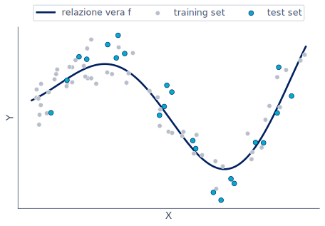{width="100%" fig-alt="Dati simulati attorno alla relazione vera, punti di training in grigio e di test in ciano"}
:::

::::

## Modelli a flessibilità crescente {footer="Orso Peruzzi · Apprendimento statistico (CONAD Nord Ovest) · Il cuore: bias-varianza"}

:::: {.columns}

::: {.column width="42%"}
- Il modello rigido (lineare) non segue la curva;
- quello equilibrato la coglie bene;
- quello troppo flessibile insegue ogni punto, anche il rumore;
- sul training set, più flessibilità sembra sempre meglio.
:::

::: {.column width="58%"}
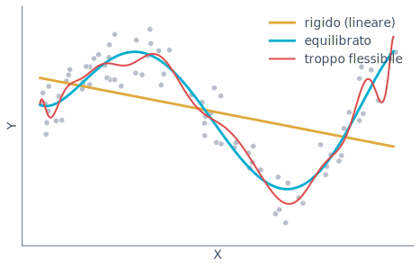{width="100%" fig-alt="Stesso training set con tre fit: lineare rigido, equilibrato, e uno troppo flessibile e ondulato"}
:::

::::

## La U del test error {footer="Orso Peruzzi · Apprendimento statistico (CONAD Nord Ovest) · Il cuore: bias-varianza"}

:::: {.columns}

::: {.column width="42%"}
- Il training error cala sempre con la flessibilità;
- il test error prima cala, poi risale: disegna una U;
- a sinistra underfitting, a destra overfitting;
- il minimo della U è il modello che cerchiamo.
:::

::: {.column width="58%"}
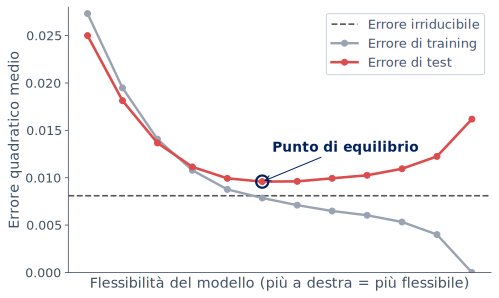{width="100%" fig-alt="Errore di training decrescente, errore di test a U, linea dell'errore irriducibile, punto di equilibrio evidenziato"}
:::

::::

## Quiz lampo: il modello che non sbaglia {footer="Orso Peruzzi · Apprendimento statistico (CONAD Nord Ovest) · Il cuore: bias-varianza"}

un modello azzecca quasi perfettamente tutti i dati di addestramento.

- A) ottimo, è il modello che cercavamo;
- B) sospetto, potrebbe overfittare e andare male sui dati nuovi;
- C) impossibile da dire senza altre informazioni.

::: {.fragment}
::: {.callout-tip icon=false title="Risposta"}
**B**. il giudice vero è il test error: un training error quasi nullo è spesso il segnale di un modello troppo flessibile.
:::
:::

## La scomposizione dell'errore {footer="Orso Peruzzi · Apprendimento statistico (CONAD Nord Ovest) · Il cuore: bias-varianza"}

l'errore di test atteso in un punto si scompone in tre pezzi:

$$
\mathbb{E}\!\left[(y_0 - \hat f(x_0))^2\right]
= \operatorname{Var}(\hat f(x_0))
+ \big[\operatorname{Bias}(\hat f(x_0))\big]^2
+ \sigma^2
$$

:::: {.columns}

::: {.column width="44%"}
- Vogliamo bassa varianza **e** basso bias insieme;
- $\sigma^2$ è l'errore irriducibile, non si tocca;
- bias e varianza dipendono dall'algoritmo che scegliamo.
:::

::: {.column width="56%"}
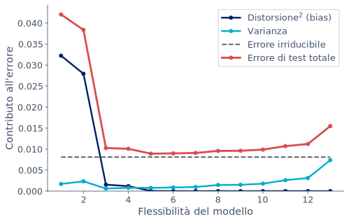{width="80%" fig-alt="Distorsione al quadrato che cala, varianza che cresce, errore irriducibile costante, errore di test totale a U"}
:::

::::

## Bias e varianza: l'intuizione del bersaglio {footer="Orso Peruzzi · Apprendimento statistico (CONAD Nord Ovest) · Il cuore: bias-varianza"}

:::: {.columns}

::: {.column width="44%"}
- Ogni tiro è il modello stimato su un campione diverso;
- **bias** alto: i tiri sono lontani dal centro in modo sistematico;
- **varianza** alta: i tiri sono molto sparsi tra loro;
- vogliamo il bersaglio in alto a sinistra: centrato e concentrato.
:::

::: {.column width="56%"}
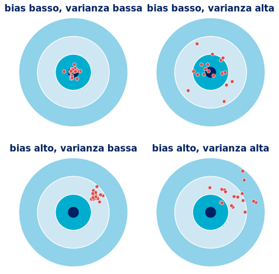{width="86%" fig-alt="Quattro bersagli con le combinazioni di bias e varianza alti e bassi"}
:::

::::

## La slide-madre: il trade-off distorsione-varianza {footer="Orso Peruzzi · Apprendimento statistico (CONAD Nord Ovest) · Il cuore: bias-varianza"}

:::: {.columns}

::: {.column width="46%"}
- Modelli troppo semplici: bias alto, varianza bassa (underfitting);
- modelli troppo flessibili: bias basso, varianza alta (overfitting);
- l'errore di test minimo sta nell'equilibrio, non agli estremi;
- vale per ogni metodo, dalla regressione alle reti profonde.
:::

::: {.column width="54%"}
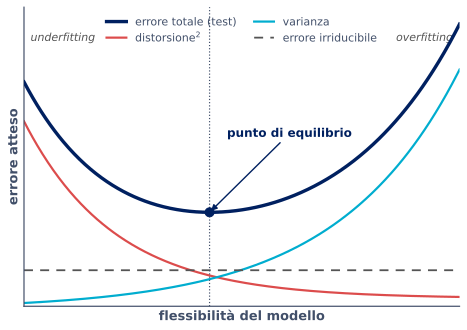{fig-alt="Curva a U dell'errore di test in funzione della flessibilità del modello"}
:::

::::

## Flessibilità vs interpretabilità {footer="Orso Peruzzi · Apprendimento statistico (CONAD Nord Ovest) · Il cuore: bias-varianza"}

:::: {.columns}

::: {.column width="42%"}
- Più flessibilità può ridurre il bias, ma costa varianza e interpretabilità;
- i modelli interpretabili stanno in alto a sinistra;
- i molto flessibili in basso a destra;
- non esiste il modello migliore in assoluto: in statistica non c'è un pasto gratis.
:::

::: {.column width="58%"}
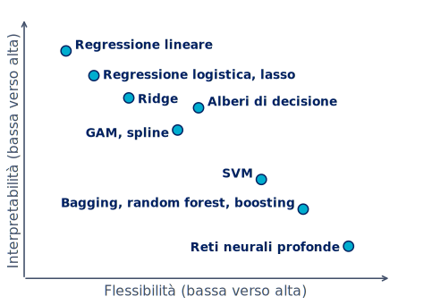{width="100%" fig-alt="Piano flessibilità-interpretabilità con i metodi posizionati, dalla regressione alle reti profonde"}
:::

::::

## Come scegliere il punto giusto: il resampling {footer="Orso Peruzzi · Apprendimento statistico (CONAD Nord Ovest) · Il cuore: bias-varianza"}

- Non possiamo usare il test set per scegliere il modello, lo falserebbe;
- validation set: si tiene da parte una fetta di dati, di solito il 25 o 30 per cento;
- k-fold: si divide in $k$ parti, si addestra su $k-1$ e si valuta sulla restante, a rotazione;
- LOOCV: il caso estremo con $k = n$, si lascia fuori un dato alla volta.

## Quiz lampo: la cross-validation {footer="Orso Peruzzi · Apprendimento statistico (CONAD Nord Ovest) · Il cuore: bias-varianza"}

a cosa serve principalmente la k-fold cross-validation?

- A) ad addestrare il modello più velocemente;
- B) a stimare l'errore su dati nuovi usando solo i dati di training;
- C) a eliminare l'errore irriducibile.

::: {.fragment}
::: {.callout-tip icon=false title="Risposta"}
**B**. stima il test error senza toccare il test set, così possiamo scegliere la flessibilità giusta.
:::
:::

## Take-home del blocco {footer="Orso Peruzzi · Apprendimento statistico (CONAD Nord Ovest) · Il cuore: bias-varianza"}

- L'obiettivo è generalizzare: conta il test error, non il training error;
- più flessibilità non è sempre meglio, per via dell'overfitting;
- bias e varianza tirano in direzioni opposte, si cerca l'equilibrio;
- cross-validation e split train/test sono gli strumenti per trovarlo.

## Blocco 3 · Le famiglie di modelli {.divider background-image="assets/title-bg-bokeh.jpeg" background-size="cover" background-position="center" background-color="#002060"}

::: {.divider-sub}
ISL, capitoli 3, 4, 6, 7, 8, 9 · una panoramica ragionata
:::

## Non un catalogo, ma una mappa {footer="Orso Peruzzi · Apprendimento statistico (CONAD Nord Ovest) · Le famiglie di modelli"}

- Non serve memorizzare ogni metodo, serve capire dove si colloca;
- ogni famiglia occupa un posto sul piano flessibilità-interpretabilità;
- l'idea ricorrente è sempre la stessa: gestire il trade-off bias-varianza;
- partiamo dalla baseline più semplice e saliamo in flessibilità.

## La baseline interpretabile: regressione lineare {footer="Orso Peruzzi · Apprendimento statistico (CONAD Nord Ovest) · Le famiglie di modelli"}

$$ \hat y = \hat\beta_0 + \hat\beta_1 x_1 + \dots + \hat\beta_p x_p $$

- I coefficienti si stimano con i minimi quadrati, minimizzando la somma dei quadrati dei residui;
- ogni $\hat\beta_j$ dice quanto pesa quel predittore, a parità degli altri;
- esempio ISL: vendite in funzione dei budget TV, radio, volantino;
- semplice, veloce, interpretabile: il punto di partenza, non il nemico.

## Classificazione interpretabile: regressione logistica {footer="Orso Peruzzi · Apprendimento statistico (CONAD Nord Ovest) · Le famiglie di modelli"}

:::: {.columns}

::: {.column width="48%"}
modella la probabilità dell'evento tramite il logit:

$$ \log\frac{p(X)}{1-p(X)} = \beta_0 + \beta_1 X_1 + \dots $$

- la probabilità resta tra 0 e 1, curva a S;
- esempio ISL, dataset Default: prevedere l'insolvenza dal saldo;
- baseline della classificazione del pomeriggio.
:::

::: {.column width="52%"}
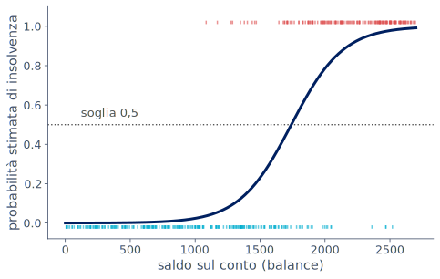{width="100%" fig-alt="Curva logistica a S della probabilità di insolvenza in funzione del saldo"}
:::

::::

## Il classificatore di Bayes e i k vicini {footer="Orso Peruzzi · Apprendimento statistico (CONAD Nord Ovest) · Le famiglie di modelli"}

:::: {.columns}

::: {.column width="48%"}
- Il classificatore ideale assegna alla classe più probabile, $\max_j \Pr(Y=j \mid X=x_0)$;
- non conosciamo quella probabilità, la stimiamo;
- KNN la approssima coi $K$ vicini più prossimi;
$$ \hat\Pr(Y=j\mid x_0)=\frac{1}{K}\sum_{i\in N_0} I(y_i=j) $$
:::

::: {.column width="52%"}
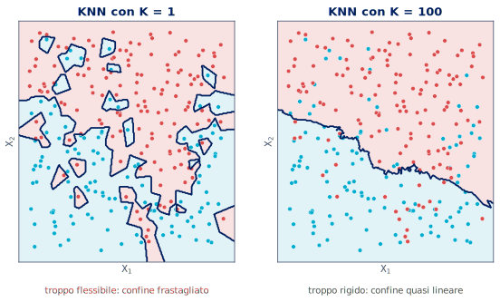{width="100%" fig-alt="Confini di decisione KNN: con K uguale a 1 frastagliato, con K uguale a 100 quasi lineare"}
:::

::::

## Anche qui il trade-off {footer="Orso Peruzzi · Apprendimento statistico (CONAD Nord Ovest) · Le famiglie di modelli"}

:::: {.columns}

::: {.column width="44%"}
- $K$ piccolo: confine flessibile, alta varianza, rischio overfitting;
- $K$ grande: confine liscio, alto bias;
- la flessibilità si misura con $1/K$;
- stessa U del test error vista per la regressione.
:::

::: {.column width="56%"}
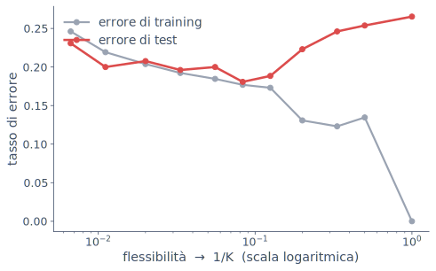{width="100%" fig-alt="Tasso di errore di training e test in funzione di 1 su K, con la U del test error"}
:::

::::

## Quando i predittori sono troppi {footer="Orso Peruzzi · Apprendimento statistico (CONAD Nord Ovest) · Le famiglie di modelli"}

- Con tanti predittori, o predittori molto correlati, i minimi quadrati diventano instabili;
- il modello insegue il rumore e overfitta, la varianza esplode;
- servono pochi coefficienti grandi e affidabili, non tanti coefficienti ballerini;
- la soluzione si chiama regolarizzazione.

## Regolarizzazione: ridge {footer="Orso Peruzzi · Apprendimento statistico (CONAD Nord Ovest) · Le famiglie di modelli"}

$$ \min_{\beta}\ \sum_{i=1}^{n}\big(y_i-\hat y_i\big)^2 + \lambda \sum_{j=1}^{p}\beta_j^2 $$

- Alla somma degli errori si aggiunge una penalità $L_2$ sui coefficienti;
- la penalità spinge i coefficienti verso lo zero, senza azzerarli;
- il parametro $\lambda$ regola quanto si stringe, lo si sceglie in cross-validation;
- riduce la varianza accettando un po' di bias: di nuovo il trade-off.

## Regolarizzazione: lasso e sparsità {footer="Orso Peruzzi · Apprendimento statistico (CONAD Nord Ovest) · Le famiglie di modelli"}

:::: {.columns}

::: {.column width="44%"}
$$ \min_{\beta}\ \sum_{i=1}^{n}\big(y_i-\hat y_i\big)^2 + \lambda \sum_{j=1}^{p}|\beta_j| $$

- La penalità $L_1$ può azzerare del tutto alcuni coefficienti;
- in pratica fa selezione delle variabili;
- la geometria del vincolo spiega perché solo il lasso produce zeri.
:::

::: {.column width="56%"}
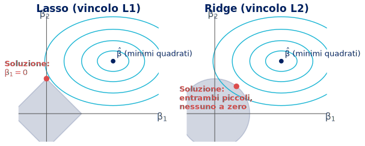{width="100%" fig-alt="Geometria di lasso e ridge: il rombo del lasso tocca un vertice azzerando un coefficiente, il cerchio del ridge no"}
:::

::::

## Quiz lampo: ridge o lasso? {footer="Orso Peruzzi · Apprendimento statistico (CONAD Nord Ovest) · Le famiglie di modelli"}

avete cento predittori e sospettate che solo una decina conti davvero. volete un modello che lo dica.

- A) ridge, restringe tutti i coefficienti;
- B) lasso, azzera quelli inutili e tiene i pochi che contano;
- C) minimi quadrati senza penalità.

::: {.fragment}
::: {.callout-tip icon=false title="Risposta"}
**B**, lasso: la penalità $L_1$ porta a zero i coefficienti irrilevanti, facendo selezione automatica.
:::
:::

## Oltre la linearità: polinomi e spline {footer="Orso Peruzzi · Apprendimento statistico (CONAD Nord Ovest) · Le famiglie di modelli"}

:::: {.columns}

::: {.column width="46%"}
- A volte la relazione non è una retta, ad esempio i salari che salgono con l'età e poi calano;
- polinomi: aggiungo $x^2, x^3, \dots$, ma instabili agli estremi;
- spline: curve flessibili a tratti, molto più stabili;
- esempio ISL: il dataset Wage, salario in funzione dell'età.
:::

::: {.column width="54%"}
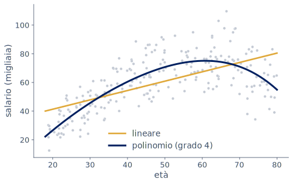{width="100%" fig-alt="Salario in funzione dell'età: fit lineare contro polinomio di grado quattro"}
:::

::::

## GAM, modelli additivi generalizzati {footer="Orso Peruzzi · Apprendimento statistico (CONAD Nord Ovest) · Le famiglie di modelli"}

$$ y = \beta_0 + f_1(x_1) + f_2(x_2) + \dots + f_p(x_p) + \varepsilon $$

- Una funzione liscia per ogni predittore, sommate insieme;
- catturano relazioni non lineari mantenendo l'additività;
- si può leggere l'effetto di ogni variabile separatamente;
- un buon compromesso tra flessibilità e interpretabilità.

## Metodi ad albero: l'albero di decisione {footer="Orso Peruzzi · Apprendimento statistico (CONAD Nord Ovest) · Le famiglie di modelli"}

:::: {.columns}

::: {.column width="42%"}
- Una sequenza di domande sì o no che divide i clienti in gruppi;
- molto intuitivo, facile da spiegare a chiunque;
- ma un singolo albero è instabile e tende a overfittare;
- da qui l'idea di combinarne molti, gli ensemble.
:::

::: {.column width="58%"}
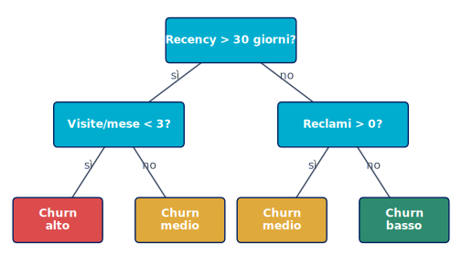{width="100%" fig-alt="Albero di decisione per il churn: domande su recency, visite e reclami, con foglie di rischio churn"}
:::

::::

## Dagli alberi agli ensemble {footer="Orso Peruzzi · Apprendimento statistico (CONAD Nord Ovest) · Le famiglie di modelli"}

::: {.incremental}
- Bagging: media tanti alberi addestrati su campioni diversi, abbatte la varianza;
- random forest: bagging più decorrelazione degli alberi, di solito molto efficace;
- boosting: alberi piccoli aggiunti in sequenza, ognuno corregge gli errori del precedente;
- nel pomeriggio vedremo dal vivo l'albero che overfitta e la foresta che lo stabilizza.
:::

## SVM: margine massimo e kernel {footer="Orso Peruzzi · Apprendimento statistico (CONAD Nord Ovest) · Le famiglie di modelli"}

- L'idea: separare le classi con il confine che lascia il margine più ampio;
- contano solo i punti vicini al confine, i vettori di supporto;
- il trucco del kernel permette confini non lineari senza costruire nuove feature a mano;
- efficace anche quando i predittori sono molti.

## Tutto sullo stesso piano {footer="Orso Peruzzi · Apprendimento statistico (CONAD Nord Ovest) · Le famiglie di modelli"}

:::: {.columns}

::: {.column width="42%"}
- Nessun modello è il migliore in assoluto, è il "no free lunch";
- a sinistra gli interpretabili, a destra i flessibili;
- più flessibilità non è sempre meglio: dipende da dati e rumore;
- la scelta è un compromesso guidato dall'obiettivo.
:::

::: {.column width="58%"}
{width="100%" fig-alt="Piano flessibilità-interpretabilità con tutti i metodi posizionati"}
:::

::::

## Blocco 4 · Reti neurali e la big picture {.divider background-image="assets/title-bg-bokeh.jpeg" background-size="cover" background-position="center" background-color="#002060"}

::: {.divider-sub}
ISL, capitolo 10 · dove va a finire il continuum
:::

## Il neurone: una regressione vestita a festa {footer="Orso Peruzzi · Apprendimento statistico (CONAD Nord Ovest) · Reti neurali e big picture"}

$$ a = g\!\left(w_0 + \sum_{j=1}^{p} w_j x_j\right) $$

- Un neurone fa una combinazione lineare degli input, come la regressione;
- poi applica una funzione non lineare $g$, l'attivazione, che gli dà espressività;
- di per sé è poco più di una regressione;
- la potenza nasce quando se ne impilano tanti.

## Reti profonde: cosa cambia davvero {footer="Orso Peruzzi · Apprendimento statistico (CONAD Nord Ovest) · Reti neurali e big picture"}

- Impilando strati la rete costruisce rappresentazioni sempre più astratte dei dati;
- non scegliamo noi le feature: le impara la rete, è il feature learning;
- è una $f$ estremamente flessibile, in fondo è ancora $Y = f(X)$;
- più flessibilità porta più potenza ma anche più rischio di overfitting.

## È ancora apprendimento statistico {footer="Orso Peruzzi · Apprendimento statistico (CONAD Nord Ovest) · Reti neurali e big picture"}

- Stessi concetti del mattino: training e test, overfitting, regolarizzazione, validazione;
- una rete senza regolarizzazione overfitta come un polinomio di grado troppo alto;
- più dati e più capacità spostano il trade-off bias-varianza, non lo eliminano;
- niente magia: gli stessi principi, su scala molto più grande.

## Quiz lampo: la rete profonda {footer="Orso Peruzzi · Apprendimento statistico (CONAD Nord Ovest) · Reti neurali e big picture"}

una rete neurale profonda è governata dal trade-off bias-varianza?

- A) no, è un paradigma completamente diverso;
- B) sì, vale lo stesso trade-off, solo con una $f$ molto più flessibile;
- C) solo se ha pochi strati.

::: {.fragment}
::: {.callout-tip icon=false title="Risposta"}
**B**. una rete è apprendimento statistico a tutti gli effetti: stesso trade-off, stesse difese, overfitting compreso.
:::
:::

## La mappa genealogica dei modelli profondi {footer="Orso Peruzzi · Apprendimento statistico (CONAD Nord Ovest) · Reti neurali e big picture"}

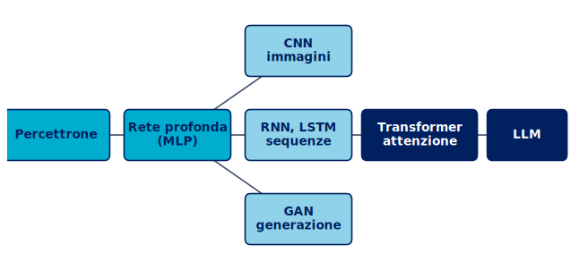{width="90%" fig-alt="Genealogia: dal percettrone alla rete profonda, poi CNN, RNN e LSTM, GAN, fino a transformer e LLM"}

- CNN per le immagini, RNN e LSTM per le sequenze, GAN per la generazione;
- i transformer, basati sull'attenzione, sono la base dei grandi modelli linguistici.

## Transformer, LLM e chiusura della tesi {footer="Orso Peruzzi · Apprendimento statistico (CONAD Nord Ovest) · Reti neurali e big picture"}

- I transformer scalano a miliardi di parametri e dati, e arrivano agli LLM;
- ma il principio resta: stimare una funzione da esempi, minimizzando una perdita;
- un continuum, non due mondi: dai minimi quadrati fino agli LLM;
- "AI tradizionale" non è serie B, è la base concettuale di tutto il resto.

## Cose importanti da ricordare {footer="Orso Peruzzi · Apprendimento statistico (CONAD Nord Ovest) · Reti neurali e big picture"}

- Conta la capacità di generalizzare, quindi il test error;
- bias e varianza vanno bilanciati, evitando l'overfitting;
- gli strumenti: split train/test, k-fold cross-validation, criteri con penalità;
- lo stesso impianto regge dalla regressione lineare alle reti profonde.

## Si va in laboratorio {footer="Orso Peruzzi · Apprendimento statistico (CONAD Nord Ovest) · Reti neurali e big picture"}

nel pomeriggio, code-along su Colab:

- NB0, setup e prima previsione;
- NB1, regressione e bias-varianza resi visibili;
- NB2, classificazione, regolarizzazione e cross-validation;
- NB3, alberi, ensemble e il caso retail in stile Conad;
- NB4, una piccola rete neurale che richiama tutto il mattino.

## Riferimenti e materiali {.divider background-image="assets/title-bg-bokeh.jpeg" background-size="cover" background-position="center" background-color="#002060"}

::: {.divider-sub}
i notebook, i dati e la bibliografia per riprendere tutto a casa
:::

## I notebook del pomeriggio {footer="Orso Peruzzi · Apprendimento statistico (CONAD Nord Ovest) · Riferimenti"}

si aprono direttamente in Google Colab, senza installare nulla:

- [NB0 · setup e warm-up](https://colab.research.google.com/github/battles5/conad-statistical-learning/blob/main/notebooks/NB0_setup.ipynb);
- [NB1 · regressione e bias-varianza](https://colab.research.google.com/github/battles5/conad-statistical-learning/blob/main/notebooks/NB1_regressione_biasvarianza.ipynb);
- [NB2 · classificazione, regolarizzazione e CV](https://colab.research.google.com/github/battles5/conad-statistical-learning/blob/main/notebooks/NB2_classificazione_regolarizzazione.ipynb);
- [NB3 · ensemble e caso retail Conad](https://colab.research.google.com/github/battles5/conad-statistical-learning/blob/main/notebooks/NB3_ensemble_caso_retail.ipynb);
- [NB4 · demo reti neurali](https://colab.research.google.com/github/battles5/conad-statistical-learning/blob/main/notebooks/NB4_reti_neurali.ipynb).

i dati sono caricati via URL dal repo, quindi i notebook girano anche a casa.

## Libri di riferimento {footer="Orso Peruzzi · Apprendimento statistico (CONAD Nord Ovest) · Riferimenti"}

- James, Witten, Hastie, Tibshirani, Taylor (2023), *An Introduction to Statistical Learning with Applications in Python*, Springer (il testo guida, gratuito su statlearning.com);
- James, Witten, Hastie, Tibshirani (2020), *Introduzione all'apprendimento statistico*, Piccin (edizione italiana, per la terminologia);
- Hastie, Tibshirani, Friedman (2009), *The Elements of Statistical Learning*, Springer (il riferimento avanzato);
- Torelli (2024), *Una breve introduzione all'Apprendimento Statistico (o Machine Learning)*, Università di Trieste.

## Articoli fondativi {.smaller footer="Orso Peruzzi · Apprendimento statistico (CONAD Nord Ovest) · Riferimenti"}

- Breiman (2001), *Statistical Modeling: The Two Cultures*, Statistical Science (modeling vs learning);
- Geman, Bienenstock, Doursat (1992), *Neural Networks and the Bias/Variance Dilemma*, Neural Computation;
- Hoerl, Kennard (1970), *Ridge Regression*, Technometrics;
- Tibshirani (1996), *Regression Shrinkage and Selection via the Lasso*, JRSS B;
- Breiman (2001), *Random Forests*, Machine Learning;
- Friedman (2001), *Greedy Function Approximation: a Gradient Boosting Machine*, Annals of Statistics;
- Cortes, Vapnik (1995), *Support-Vector Networks*, Machine Learning;
- LeCun, Bengio, Hinton (2015), *Deep Learning*, Nature;
- Vaswani et al. (2017), *Attention Is All You Need*, NeurIPS (i transformer, base degli LLM).

## Strumenti e dati {footer="Orso Peruzzi · Apprendimento statistico (CONAD Nord Ovest) · Riferimenti"}

- Scikit-learn: Pedregosa et al. (2011), *Scikit-learn: Machine Learning in Python*, JMLR;
- dataset canonici ISL: Auto, Default, Carseats;
- dataset retail sintetico stile Conad: generato per questo corso, riproducibile con `data/genera_dataset.py`;
- tutto il materiale vive in un unico repo pubblico, questo sito ne è la spina dorsale.

## Grazie {.divider background-image="assets/title-bg-bokeh.jpeg" background-size="cover" background-position="center" background-color="#002060"}

::: {.divider-sub}
Orso Peruzzi · Data Scientist, IFAB · domande?
:::
